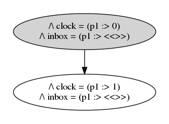
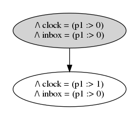
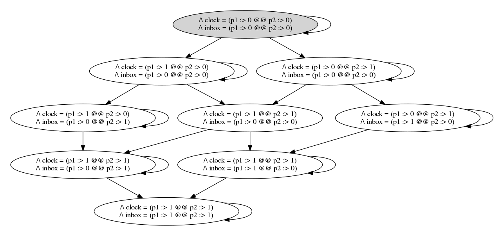
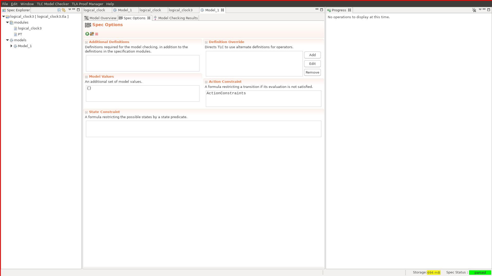
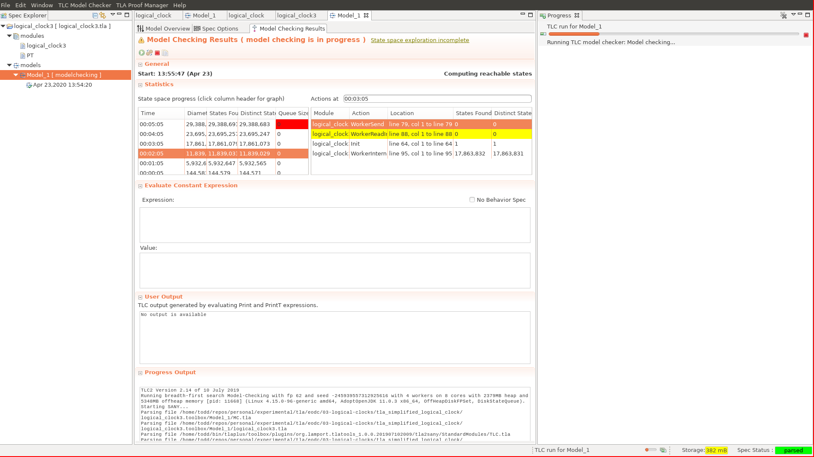
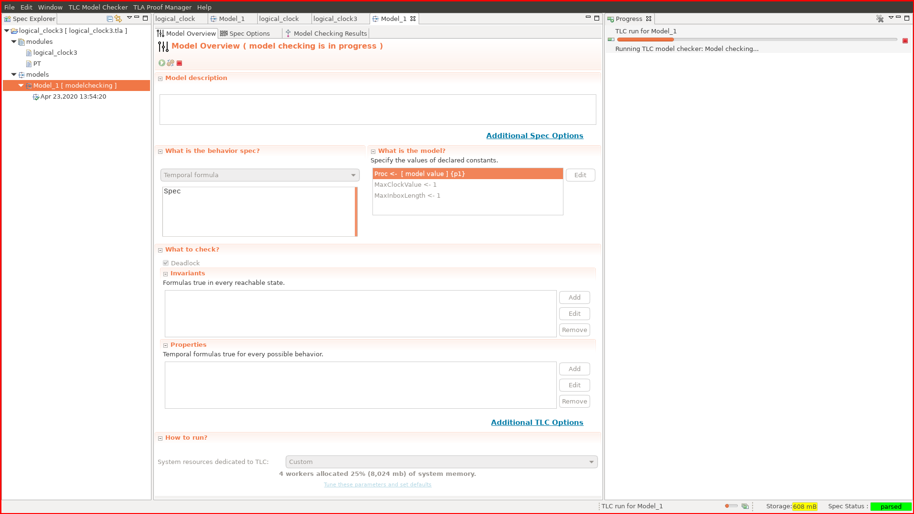
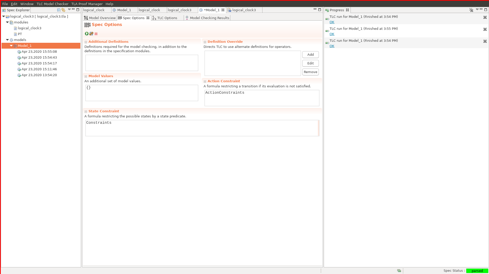
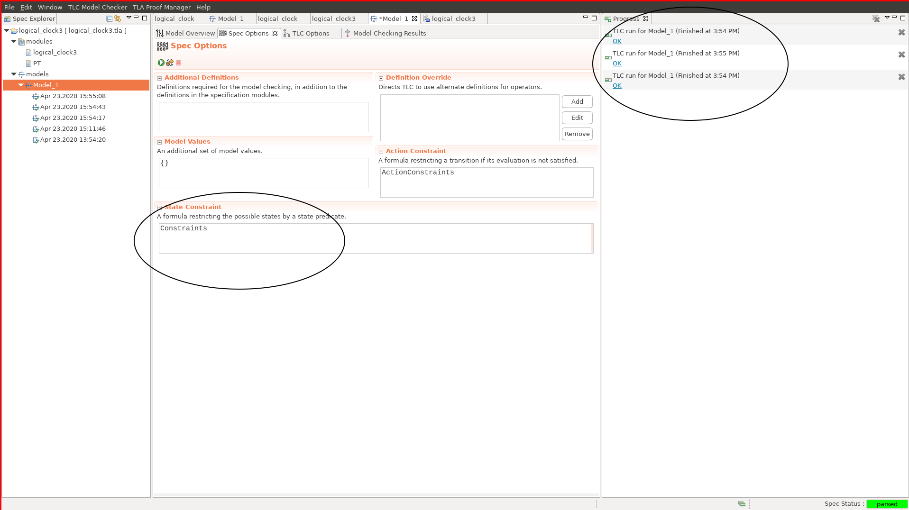

# Simplified TLA Spec for a Logical Clock


## Using TLC command line

If I limit the variables to just the bare minimum, can I start to reason about
a logical clock, using just the command line tooling `tlc`?

```
VARIABLES 
    clock,                      \* each clock has it's current value 
    inbox                       \* each clock process has a msg inbox (queue)

vars  == << clock, inbox >>
```

----

* [Spec1](./logical_clock1.tla)

### Constraints

How much can I constrain/loosen the state space and still be able to reason
about this problem?

#### One process

```
CONSTANT Proc = { p1 }
CONSTANT MaxClockValue = 1
CONSTANT MaxInboxLength = 1
```

At this point, the clock can be 0..1, but the inbox can only be [<<>>] because
the single process has no _other_ process to send to.

This generates:

```
3 states generated, 2 distinct states found, 0 states left on queue.
The depth of the complete state graph search is 2.
```


#### Two processes

```
CONSTANT Proc = { p1, p2 }
CONSTANT MaxClockValue = 1
CONSTANT MaxInboxLength = 1
```

Now we have two processes, which each can have a clock that can be 0..1, and an
inbox that can be [<<>>, <<0>>, <<0, 1>>, <<1>>].

This generates:

```
131 states generated, 25 distinct states found, 0 states left on queue.
The depth of the complete state graph search is 5.
```


##### Two Weird Errors

First, I don't see any nodes in the graph above that have anything but
[<<>>, <<0>>, <<1>>]... where are the [<<0,1>>] entries?

Second, have an unnecessary bi-directional relationship here:


I had thought it would be *cleaner* to empty the inbox after reading it. This
seems like something that you would want to do. However, has this increased my
state space? It definitely seems to cause this invalid bi-direction. I guess
this is not really necessary b/c each read is taking the maximum value anyway.
What does this look like if I remove that optimization? 

----

* [Spec2](./logical_clock2.tla)

Remove this line that cleared the inbox during the read:
```
inbox' = [inbox EXCEPT ![self] = <<>>]
```

From WorkerReadInbox so it now looks like:

```
WorkerReadInbox(self) ==
    /\ inbox[self] # <<>>
    /\ LET 
            inbox_max == PT!ReduceSeq(PT!Max, inbox[self], 0)
        IN 
            /\ IF inbox_max > clock[self]
                THEN clock' = [clock EXCEPT ![self] = inbox_max + 1]
                ELSE
                    /\ TRUE
                    /\ UNCHANGED << clock, inbox >>
```


The one process graph looks the same...

```
3 states generated, 2 distinct states found, 0 states left on queue.
The depth of the complete state graph search is 2.
```



The two process graph looks almost the same...

```
127 states generated, 25 distinct states found, 0 states left on queue.
The depth of the complete state graph search is 5.
```


The difference is the unnecessary bi-directional arrows are gone.

That didn't make as much of a difference as I'd hoped for, and I still don't
know what happened to [<<0, 1>>] in the inbox.

##### Fix the Inbox

Since we only ever pull the `max` value out of the inbox queue, it doesn't need
to be a list/queue. It could just be a single (max) value.

----

[Spec3](./logical_clock3.tla)


The one process case looks the same as before...

```
3 states generated, 2 distinct states found, 0 states left on queue.
The depth of the complete state graph search is 2.
```



But the two process case has significantly reduced the state space:

```
39 states generated, 9 distinct states found, 0 states left on queue.
The depth of the complete state graph search is 5.
```



Now we are getting somewhere! So we decreased the state space from 127/25 to 39/9.


#### Three processes

Continuing with the third spec and 3 processes...

```
CONSTANT Proc = { p1, p2, p3 }
CONSTANT MaxClockValue = 1
CONSTANT MaxInboxLength = 1
```

Now we have three processes.

The second spec generated:

```
1795 states generated, 170 distinct states found, 0 states left on queue.
The depth of the complete state graph search is 7.
```


Whereas the third spec with the inbox reduced from a list to a single value generated:

```
430 states generated, 45 distinct states found, 0 states left on queue.
The depth of the complete state graph search is 7.
```


## Using the TLA+ Toolbox

In a reply to my question on the TLA+ email list, [Leslie Lamport suggested
using the `toolbox
model`](https://groups.google.com/d/msg/tlaplus/o26fE2TClIg/D7KqgmVLAwAJ).

Now that I have a handle on how to write the spec more succinctly, I should
examine how to use the toolbox more effectively...

### Action Constraints

The first interesting thing I've found are `Action Constraints` (Specifying
Systems page 241).

So I add this to my `.cfg` files:

```
ACTIONCONSTRAINTS
    ActionConstraints
```

----

[Spec4](./logical_clock4.tla)

And add the `ActionConstraints` to logical_clock4.tla:

```
\* ---------------------------------------------------------------------------
\* ActionConstraints
\* ---------------------------------------------------------------------------

ClocksNeverDecrease ==
    \A p \in Proc : ~(clock'[p] < clock[p]) /\ ~(inbox'[p] < inbox[p])

ActionConstraints ==
    /\ ClocksNeverDecrease
```

The runtime outputs seem to be the same, but it's nice to know how to handle
this type of invariant. Now I can see that I did not need `inbox` to be a list
as well as the `sent` and `received` variables.


### Weird GUI Behaviour

Say you are just starting out with the GUI Toolbox. You may get some strange
behaviour... here's what happened to me. It was PEBKAC..., but I'll describe
it here to save you some time:

Here's how long it was taking me to run all the variants of my spec from
the command line... less than 20 seconds.

```
time ./run.sh
...
real	0m17.886s
user	0m32.272s
sys	0m1.453s
```

Whereas when I was running [Spec3](./logical_clock3.tla) with the equivalent of
[A.cfg](./A.cfg)...well it turned my laptop into a heater and I stopped it
after 5 minutes.

A.cfg
```
SPECIFICATION Spec
CONSTANT Proc = { p1, p2, p3 }
CONSTANT MaxClockValue = 1
CONSTANT MaxInboxLength = 1
INVARIANTS
    Invariants
CONSTRAINTS
    Constraints 
```

Screenshots

* 
* 
* 
* 

Can you see what's missing? I didn't. [Markus Showed me
here](https://github.com/tlaplus/tlaplus/issues/446) that I was missing my
CONSTRAINTS from the generated config file...  The smoking gun is the first
picture of the Spec Options that shows nothing in the CONSTRAINTS box.


Once I added this in the GUI as shown on the left, here:

* 
* 

Then this showed up in the `logical_clock3.toolbox/Model_1/MC.cfg` file:

```
\* CONSTRAINT definition
CONSTRAINT
constr_158768250461834000
```

Now that we have a constraint, this runs swimmingly as you can see in the 
right circle (above screenshot).

### TODO

TODO 1: Wouldn't it be cool if the `tlc` runtime stats could be dumped in
xml/json? Then I could create tables of various spec optimizations and
correlate them with graph depths and runtimes. For example, I'd like to start
increasing the state space and verify that this algorithm works for a few more
values...

TODO 2: Do I need to add liveness to this spec? What does strong and weak
fairness mean here?

TODO 3: What's the symmetry between each of these processes?

## Email Threads

* [Leslie Lamport Suggests using the Toolbox](https://groups.google.com/d/msg/tlaplus/o26fE2TClIg/D7KqgmVLAwAJ)
